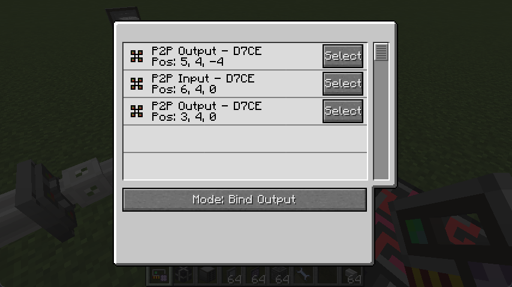
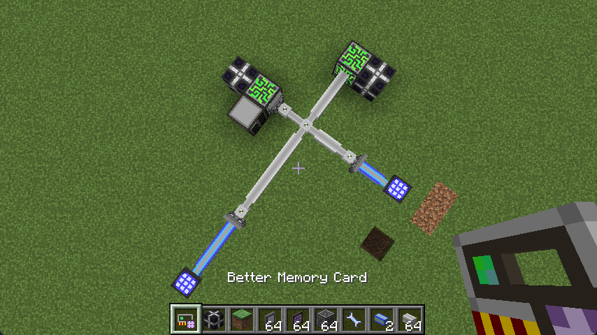
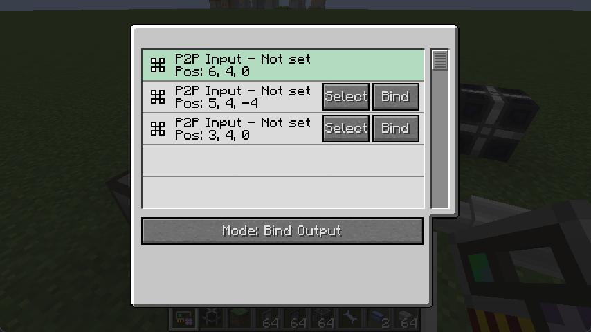
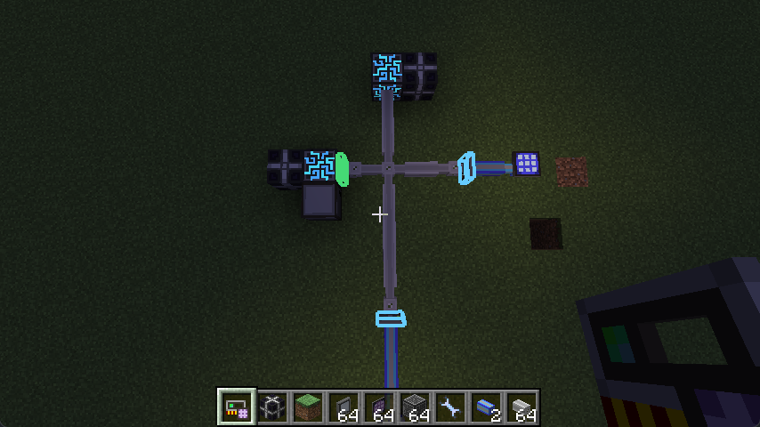

# Basic Usage

This chapter shows you how to use this tool hand-by-hand.

## Acquiring the tool

Craft the tool using Memory Card and Network Tool from AE2. May be vary in modpacks.

## Select a network

While handling this tool, right-click a ME cable or a device connected to the ME network. If you right-clicked on a P2P tunnel, the tool will have it selected.

Once a network is selected, a GUI will show up, which is the main interface of this tool. It lists all the P2P device in the target ME network.

## Example: Establish P2P tunnels

Let's see a example, we want to connect blue network to a ME Controller and use white network as a delegate.

Obviously we want to setup a tunnel between the P2P next to the controller and two P2P facing to blue network. How do we achieve that?
We simply use this tool on the P2P next to the controller, thus will make it "selected".

A GUI will popup. Green background indicates we are currently selecting this P2P device. Switch the mode below to "Bind Output" and click "Bind" on the other two P2P devices.

It's working! We can see that the tool auto generates a new frequency and connect two P2P outputs to this network. Our Crafting Terminals are getting their channels too.

## Overlay

After you select a P2P device **with frequency**, it will have a green outlet in the world, and devices with the same frequency will be in blue. This helps you to find paired P2P devices. To clear this outlet, simply hold your Better Memory Card and press Shift+Right click.

The mod doesn't check whether the outlet is valid to ensure performance. Please select a P2P device again or clear the outlet after you changed the ME network outside the GUI.

## What's Next?

You may find that there are other modes to switch to, we will discuss them in the following chapters.