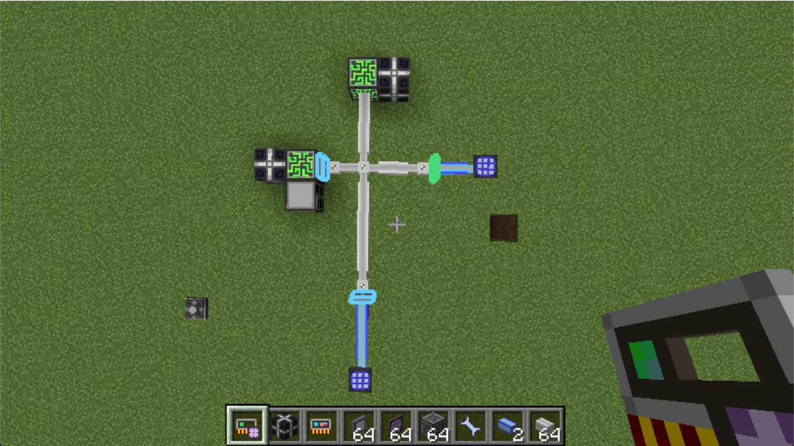
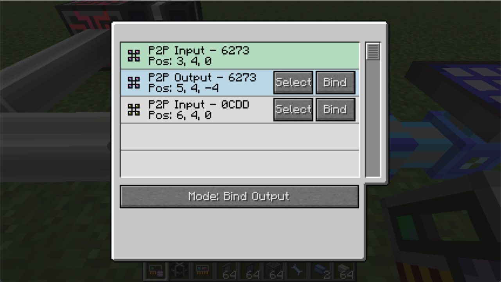

# Mode: Bind Output

In the first chapter we talked about how to use this tool from scratch. However, in most cases we have to edit existing networks.
So Better Memory Card provides three binding modes to cover all binding scenarios.

Before we going into that, let's talk about the basic binding concept in this mod.

## Binding Concept

Basically while you click "Bind" button, there is always a "input" P2P device and a "output" P2P device.

If the "input" P2P device has no frequency or it is an output, a new frequency is generated and assigned to it, and it will be set to input.

The "output" P2P device will then set to the same frequency to it.

For details, you can view the code [here](https://github.com/LasmGratel/BetterP2P/blob/master/src/main/java/com/projecturanus/betterp2p/util/p2p/P2PUtil.kt#L13).

## Scenario

Example: We want to modify the first setup, so that the P2P device on the right can be the input and the P2P device on the bottom can be output.

We simply select the P2P device on the right and press "Bind" button on the other output P2P device.

Now it has been assigned a new frequency and changed to Input.
