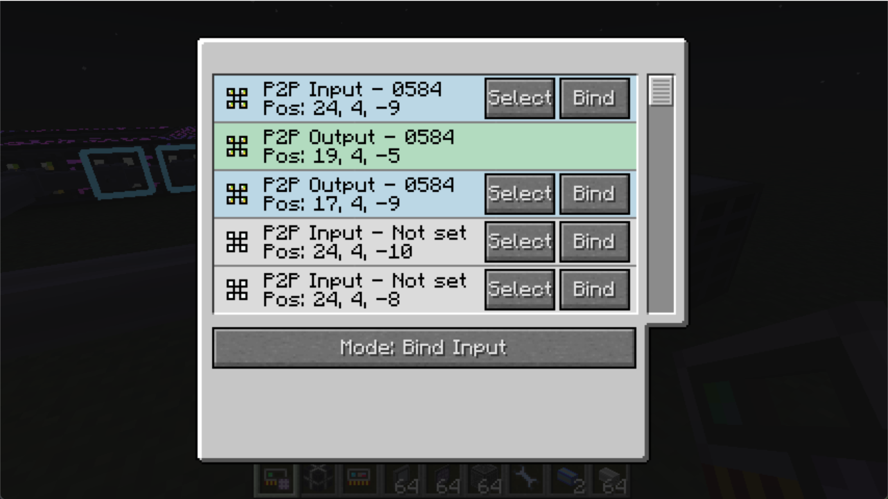

# Mode: Bind Input

## Scenario

Example: You have placed several P2P on your ME controller, and you want to connect two P2P devices to one of them.

You might want to use "Bind Output" mode, but the network is too complicated for you to find one of the outputs.

Now you can select one of the output P2P device, use "Bind Input" mode and bind what you want to be the input device. Repeat this operation again and now the blue networks will be linked to the controller.

