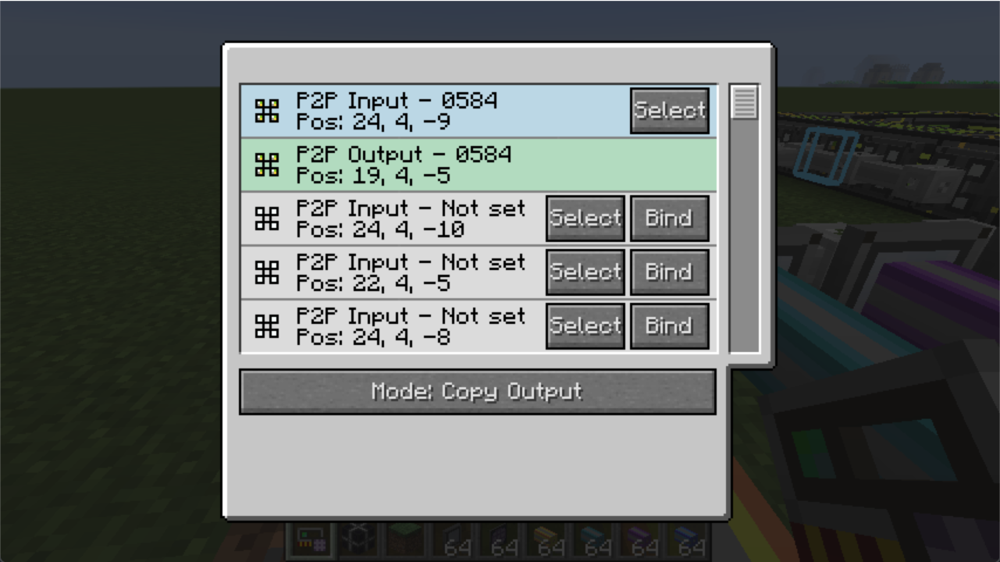

# Mode: Copy Output

This mode will copy selected P2P device's frequency to other device.

## Scenario

Example: We want to split a ME controller face(with 32 channel) into 4 cables. We have already setup a input-output link before. But we want to copy the frequency setting from the orange to other 3 cables.

We simply select the P2P device with orange output and switch to "Copy Output" mode. And we click bind on other 3 devices.

Now it works.
